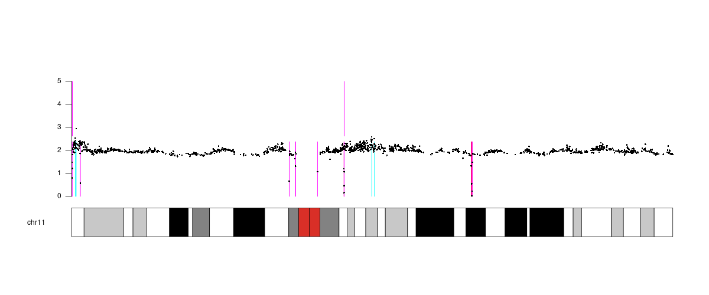

# SYNOD

## Targeted CopY Numbers frOm Depth

## Introduction

This website describes the methods used in the paper XXXX.  This paper is based on work
done on Genomics England.  That data is inaccessible except for approved projects.  The documents here
use examples based on the 1000 Genomes data which is freely available.

  and distributes files to use
a very straightforward method to look for deletions and duplications
from alignment data.

The technique is very simple and can be done wither genome-wide or for smaller regions of the genome.

Included are files to look for whole gene deletions from the 1000 genome
30x alignment files, to post-process the files and to extract small regions
for plotting using tools such as the [The Integrative Genomics Viewer (IGV)](https://software.broadinstitute.org/software/igv/).

This is a companion to the paper xxxxxxx which describes an experiment looking for deleted genes in the 1000000 genomes data
within GEL, so a detailed guide to how this was done within GEL is in the file 
[GEL instructions](docs/GEL.md).

The alignments for the [1000 genomes project](https://www.internationalgenome.org/data-portal/sample) are available as CRAM alignment files.  These files are large, and alignments
just for the 91 British in England and Scotland samples take 1.4TB
of space for CRAM files (which need to be converted to bam files
before they can be used).  We can use the files remotely which help
local storage requirements.

## Documents

* [Obtaining Region Files](docs/regions.md)
* [Analysing the 1000 Genomes](docs/1000_Genomes.md)
* [Trios from the 1000 Genomes](docs/1K_Genomes_trios.md)