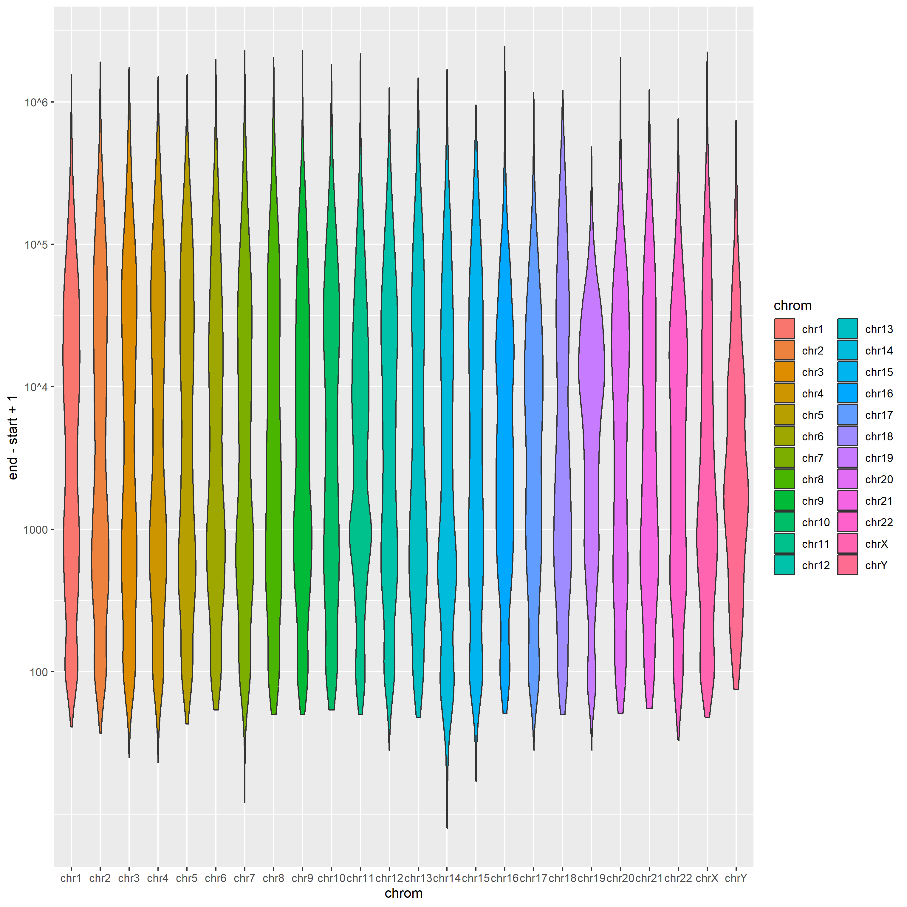

# GEL Analysis Regions.

The following R code gives you a file `gene_regions38.bed` the same as the
one used in the Genomics England analyses.  This needs the `rtracklayer`
Bioconductor library.

Further code in [get_regions.r](../R/get_regions.r) gives you a set of wide (>=8000 bp) regions and a random set of 100 regions.  This set of regions is 
in the file [100_regions.bed](../data/100_regions.bed)

```{r}
library(rtracklayer)
## GRCh38, and version 96 of genes
tr <- import("https://ftp.ensembl.org/pub/release-96/gtf/homo_sapiens/Homo_sapiens.GRCh38.96.gtf.gz")
tr <- tr[tr$type == "gene" & seqnames(tr) %in% c(1:22, "X","Y","MT")]
seqlevels(tr) <- paste0("chr", seqlevels(tr))

df <- data.frame(seqnames(tr), start(tr), end(tr), tr$gene_id, tr$gene_name)
write.table(df, file = "gene_regions38.bed", 
    row.names = FALSE, col.names = FALSE, quote = FALSE, sep = "\t") 
```
## Histogram of region widths



For depth calculations we generally use only those regions with a gene name and width of at least 8000 bases.